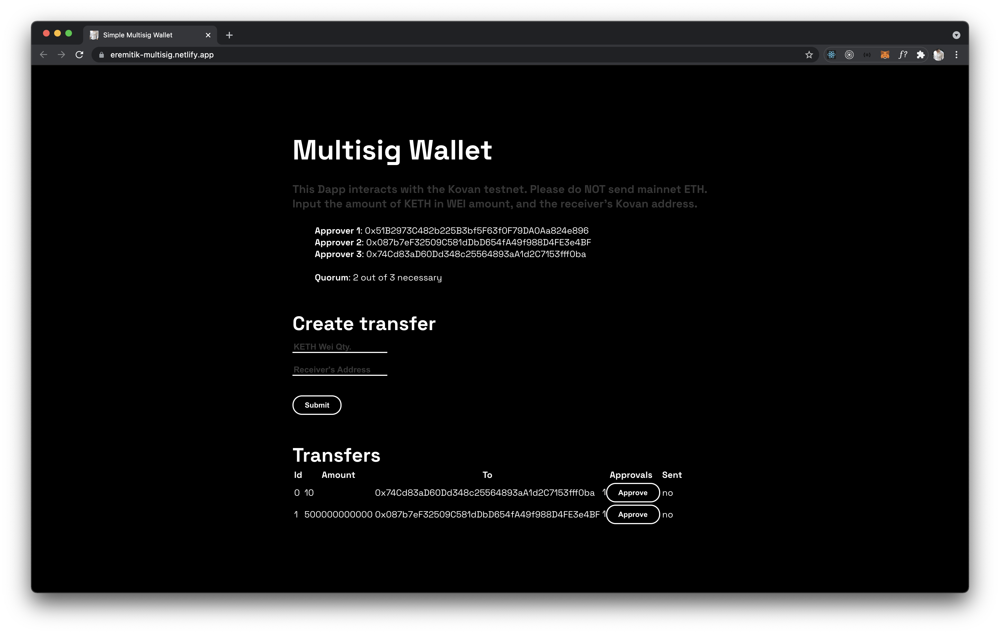

# Multi-signature Wallet

My first real attempt at building a Dapp.\
Please visit the site [here](https://eremitik-multisig.netlify.app/)!



## Quick start

You will need to have MetaMask installed, and use the Kovan test network.

```
npm install
npm start
```

## Technologies used

[React](https://reactjs.org/)\
[OpenZeppelin](https://openzeppelin.com/)\
[Solidity](https://soliditylang.org/)\
[Truffle](https://www.trufflesuite.com/ganache)
